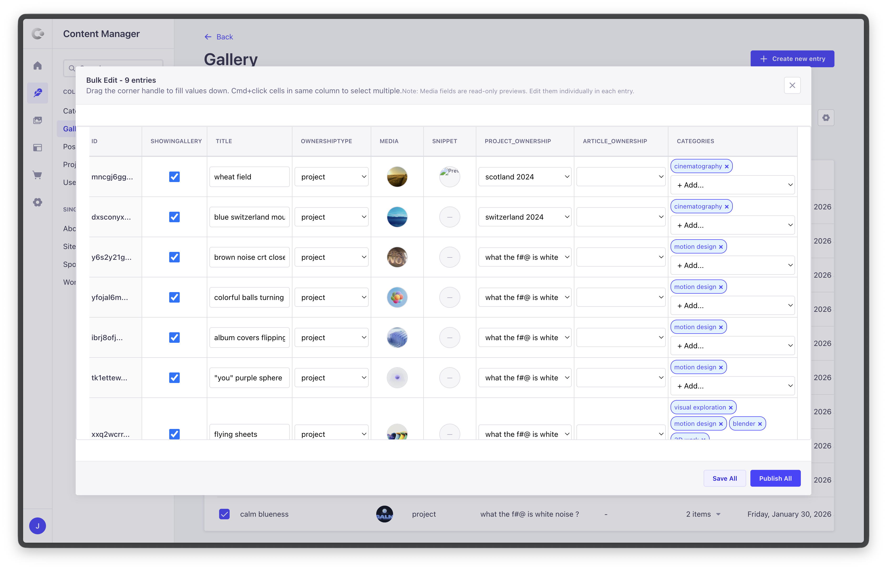

# Strapi Plugin: Bulk Editor

Edit multiple Strapi entries at once in a spreadsheet-like interface.

[](https://strapi.io/five)
[](https://www.npmjs.com/package/strapi-bulk-editor)



## Features

- **Spreadsheet View** - Edit multiple entries in a familiar table layout
- **Multi-Cell Selection** - Select and edit multiple cells at once
  - Click to select a cell
  - Cmd/Ctrl+Click to toggle additional cells (same column only)
  - Shift+Click for range selection
  - Shift+Cmd/Ctrl+Click to add a new range selection to the current selection
- **Drag to Fill** - Drag a value down to apply it to multiple rows
- **Bulk Save** - Save all changes in a single operation
- **Almost All Field Types** - Text, numbers, booleans, enums, dates, and relations… Support list below
- **Relation Support** - Full support for oneToOne, manyToOne, oneToMany, and manyToMany relations

## Requirements

- Strapi v5.0.0 or higher

## Installation

```bash
npm install strapi-plugin-bulk-editor
```

Add the plugin to your Strapi config:

```js
// config/plugins.js or config/plugins.ts
module.exports = {
  ...
  "bulk-editor": {
    enabled: true,
  },
};
```

Start your Strapi admin panel :

```bash
npm run develop
```

## Usage

1. Navigate to any content type in the Content Manager
2. Select at least one entry using the checkboxes
3. Click the **"Bulk Edit"** button in the action bar
4. Edit fields directly in the spreadsheet view
5. Click **Save** to apply all changes

> ⚠️ **Warning** : This plugin is still in beta (v0.1). It may overwrite data inadvertently. Always check before saving. When in doubt, discard the edit.

## Supported Field Types

| Type                      | Support            |
| ------------------------- | ------------------ |
| String / Text             | ✅ Full            |
| Integer / Float / Decimal | ✅ Full            |
| Boolean                   | ✅ Full            |
| Enumeration               | ✅ Full (dropdown) |
| Date / DateTime / Time    | ✅ Full            |
| Email / Password          | ✅ Full            |
| Relation (all types)      | ✅ Full            |
| JSON                      | 👁️ Read-only       |
| Rich Text / Blocks        | 👁️ Read-only       |
| Media                     | 👁️ Read-only       |
| Components                | ❌ Not supported   |
| Dynamic Zones             | ❌ Not supported   |

## License

MIT
